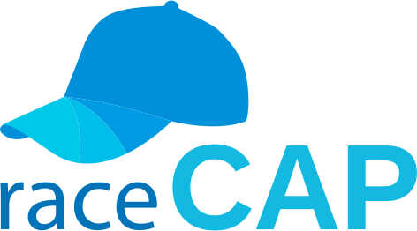
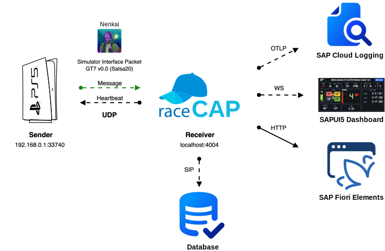
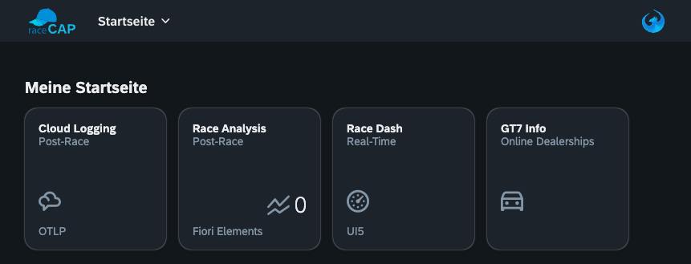
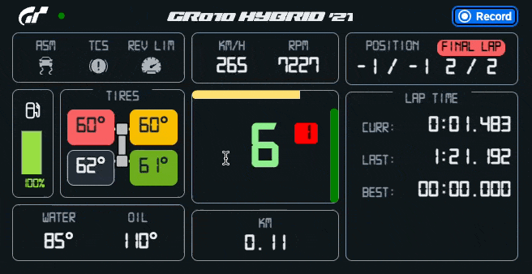
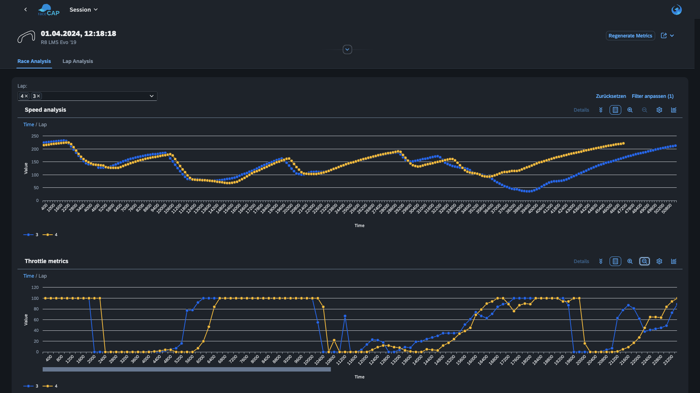
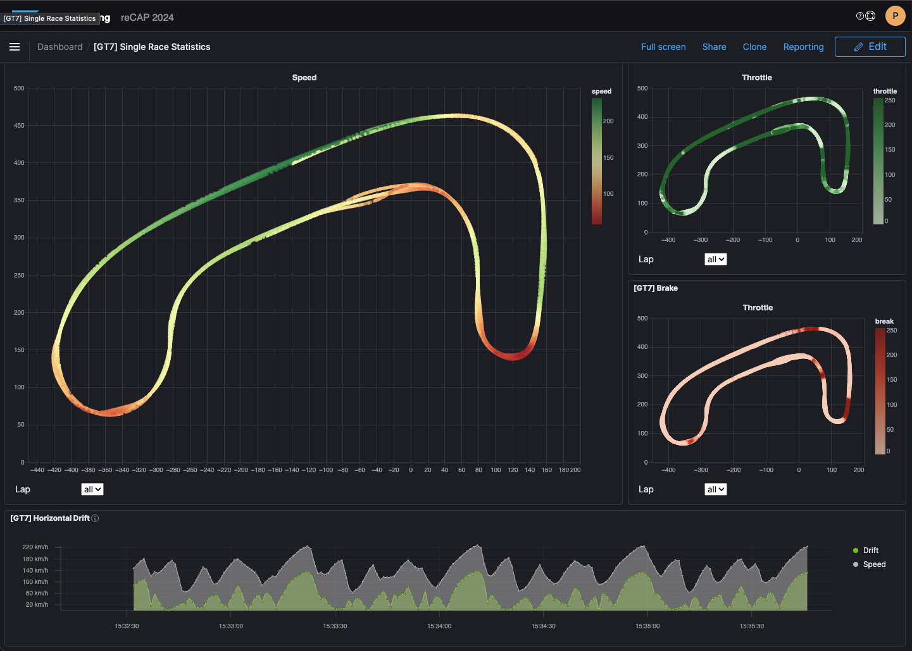
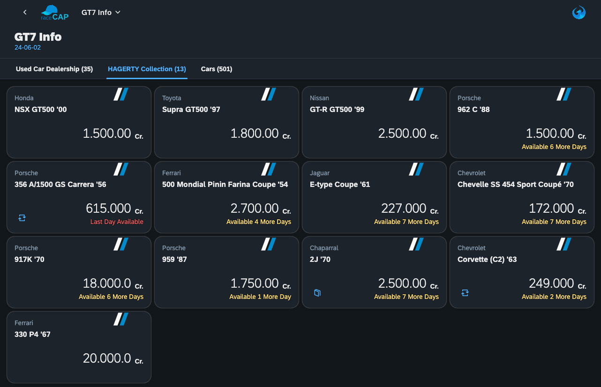

# raceCAP


Race with CAP suite to analyse Gran Turismo 7 on Sony PlayStation®5.

This demo was build for the [re>≡CAP 2024](https://recap-conf.dev/) (June 4, 2024) presentation in St. Leon-Rot, DE.

This projects depends on the findings in the thread [GT7 is compatible with motion rig ?](https://www.gtplanet.net/forum/threads/gt7-is-compatible-with-motion-rig.410728/) and mainly on the work of [Nenkai](https://twitter.com/Nenkaai) and his [PDTools](https://github.com/Nenkai/PDTools) in Python, which made this project possible. 

<br>

There is an unofficial GT7 API in which the telemetry data of a race is transmitted 60 times per second via a UDP socket on ports 33740 (bind) and 33739 (receiver).

This data forms the basis for displaying the SIM Race Telemetry data in real time in a SAPUI5 based dashboard (optimized for landscape phone view) and for starting/stopping the recording of the racing session.

After the race, the recorded telemetry data can be analyzed using a SAP Fiori Elements app.

It is also possible to transfer the data via OpenTelemetry (OTLP) to a cloud provider such as SAP BTP Cloud Logging in order to evaluate it there.

The included car data is taken from ddm999 [gt7info](https://github.com/ddm999/gt7info) repo and represents update **v1.48** from 2024-06-02.

## Setup
- Checkout project and install node dependencies using `npm install`
- Copy file `.env.example` to `.env` and change the `PLAYSTATION_IP="192.168.0.1"`<br> (if you do not have a PS5, leave the default IP!)
- Demo Mode
  - Per default, the application runs in demo mode with prerecorded data!
- Realtime Use with own Playstation 5
  - Copy file `.env.example` to `.env` and change the `PLAYSTATION_IP="192.168.0.1"`
  - Change `packages.json`section `cds/services/simulation=true` to false

### Usage
- Use the `watch` (or `watch:sqlite`) script or open a new terminal and run:
  - `npx cds-ts watch --open "launchpad.html?sap-ui-xx-viewCache=false" --livereload false` 
  - (watch:sqlite uses profile sqlite to persistently save races into db.sqlite) 
- The Launchpad automatically opens in a new browser tab:
  - `http://localhost:4004/launchpad.html?sap-ui-xx-viewCache=false`


## Launchpad
Central entry point to the applications based on the great [cds-launchpad-plugin
](https://www.npmjs.com/package/cds-launchpad-plugin) by Geert-Jan Klaps.

Currently it is not possible to control app tile order on launchpad, therefore the tiles are not ordered reflecting the usage flow like Race Dash first.

<br>

### Race Dash
The Race Dash is a SAPUI5 app triggered by the sim packets using a web socket. It can be used on an phone on top of the steering wheel to show you relevant race info.

It also allows to start recording a session, so before starting the race, you need to press th `Record` button. The recording automatically stops after finished the race (or manually by pressing it again).



### Race Analysis
SAP Fiori Elements app to analyze race sessions after flight. 

You can select you race session and compare a lap against the best lap.



### SAP Cloud Logging
This part was only demonstrated at reCAP and is not part of this repo! 

It shows an example implementation and the possibilities of the [SAP Cloud Logging](https://discovery-center.cloud.sap/serviceCatalog/cloud-logging?service_plan) service for BTP triggered by the CAP [@cap-js/telemetry](https://github.com/cap-js/telemetry#readme) plugin.



### GT7 Info
Small demo with hosted data from [gt7info](https://ddm999.github.io/gt7info/) of GT7 online car dealership, the Hagerty Collection (updated daily).

The Cars database is also used to show the name of the selected car in the Race Dash.



## Project Structure 
File or Folder | Purpose
---------|----------
`app/` | content for UI frontends and launchpad(appConfig) goes here
`db/` | your domain models and data go here
`doc/` | images for readme
`srv/` | your service models and code go here
`test/` | your rest client tests and code go here
`.cdsrc-private.template.json` | template settings for SAP Cloud Logging setup
`.env.template` | template settings for `PLAYSTATION_IP="..."` and `NO_TELEMETRY="true"` killswitch
`db.sqlite` | databse for `--profile sqlite` to persist race sessions
`package.json` | project metadata and configuration
`readme.md` | this getting started guide

### SimulatorInterfacePacket Example

```json
{
  "magic": 1194808112,
  "position": {
    "x": 0.5316166877746582,
    "y": -9.799381256103516,
    "z": 200.95875549316406
  },
  "velocity": {
    "x": -2.8569729328155518,
    "y": -0.02163977175951004,
    "z": -3.4388155937194824
  },
  "rotation": {
    "pitch": -0.008157255128026009,
    "yaw": 0.34019461274147034,
    "roll": -0.009712888859212399
  },
  "relativeOrientationToNorth": 0.9402695894241333,
  "angularVelocity": {
    "x": -0.00008933868230087683,
    "y": -0.0029604120645672083,
    "z": 0.0011315391166135669
  },
  "bodyHeight": 0.05632591247558594,
  "engineRPM": 2963,
  "gasLevel": 100,
  "gasCapacity": 100,
  "metersPerSecond": 4.4707841873168945,
  "turboBoost": 0,
  "oilPressure": 5.985651969909668,
  "waterTemperature": 85,
  "oilTemperature": 110,
  "tireSurfaceTemperature": {
    "FrontLeft": 50.54354476928711,
    "FrontRight": 48.7775764465332,
    "RearLeft": 51.38349914550781,
    "RearRight": 50.752197265625
  },
  "packetId": 31296,
  "lapCount": 2,
  "lapsInRace": 2,
  "currentLapTime": 0,
  "bestLapTime": -1,
  "lastLapTime": 106389,
  "timeOfDayProgression": 28934083,
  "preRaceStartPositionOrQualiPos": -1,
  "numCarsAtPreRace": -1,
  "minAlertRPM": 9000,
  "maxAlertRPM": 10000,
  "calculatedMaxSpeed": 272,
  "flags": 131,
  "currentGear": 2,
  "suggestedGear": 15,
  "throttle": 0,
  "brake": 0,
  "roadPlane": {
    "x": 0.014825263991951942,
    "y": 0.9997122287750244,
    "z": -0.018860744312405586
  },
  "roadPlaneDistance": 13.635237693786621,
  "wheelRevPerSecond": {
    "FrontLeft": -13.155240058898926,
    "FrontRight": -13.143295288085938,
    "RearLeft": -12.688576698303223,
    "RearRight": -12.677229881286621
  },
  "tireTireRadius": {
    "FrontLeft": 0.3400000035762787,
    "FrontRight": 0.3400000035762787,
    "RearLeft": 0.3525000214576721,
    "RearRight": 0.3525000214576721
  },
  "tireSusHeight": {
    "FrontLeft": 0.2783872187137604,
    "FrontRight": 0.278713196516037,
    "RearLeft": 0.2775541841983795,
    "RearRight": 0.27794787287712097
  },
  "clutchPedal": 1,
  "clutchEngagement": 0,
  "rpmFromClutchToGearbox": 0,
  "transmissionTopSpeed": 3.642000198364258,
  "gearRatios": [
    2.8460001945495605,
    2.2350001335144043,
    1.7650001049041748,
    1.474000096321106,
    1.218000054359436,
    1.027999997138977,
    0,
    0
  ],
  "carCode": 2158,
  "recording": false,
  "connections": 1
}
```

## Additional Resources

- [Learn more CAP](https://cap.cloud.sap/docs/get-started/in-a-nutshell)
- OpenTelemetry
  - [OpenTelemetry](https://opentelemetry.io/)
  - [OpenTelemetry (OLTP) Grafana](https://grafana.com/docs/opentelemetry/collector/)
  - [Grafana Language guides](https://grafana.com/docs/grafana-cloud/monitor-applications/application-observability/setup/quickstart/)
  - [Grafana Telemetry ACC](https://github.com/alexanderzobnin/grafana-simracing-telemetry)
  - [SRT Sim Racing Telemetry](https://www.simracingtelemetry.com/)
- Analysing
  - [On track analysis vs. Post Processing](https://www.renovatio-dev.com/vtelemetry-pro)
  - [Track Map FastF1](https://docs.fastf1.dev/examples_gallery/plot_annotate_corners.html#sphx-glr-examples-gallery-plot-annotate-corners-py)
- GitHub
  - [snipem/gt7dashboard](https://github.com/snipem/gt7dashboard)
  - [AleBles/gt-telemetry](https://github.com/AleBles/gt-telemetry)
  - [ddm999/gt7info](https://github.com/ddm999/gt7info)
  - [Bornhall/gt7telemetry](https://github.com/Bornhall/gt7telemetry)